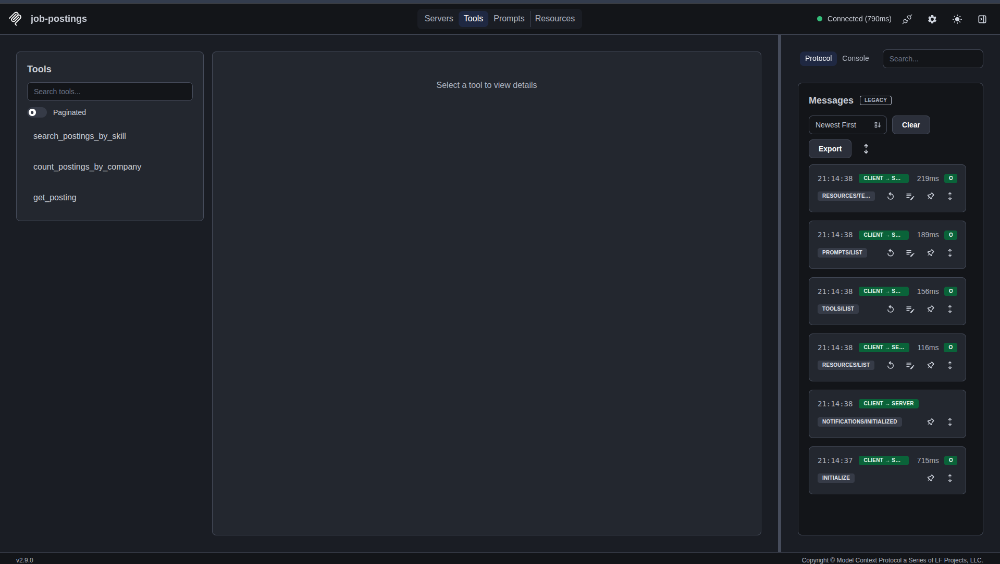
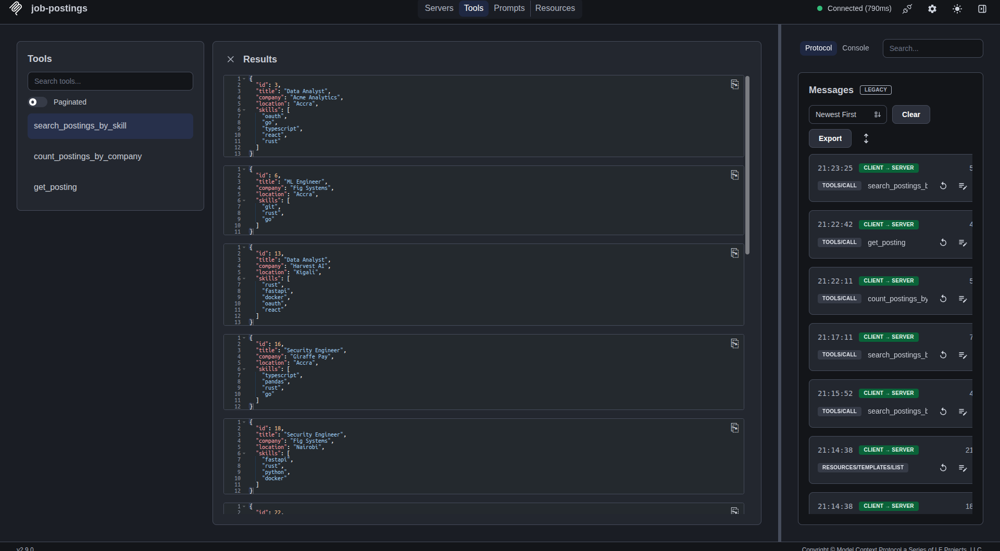
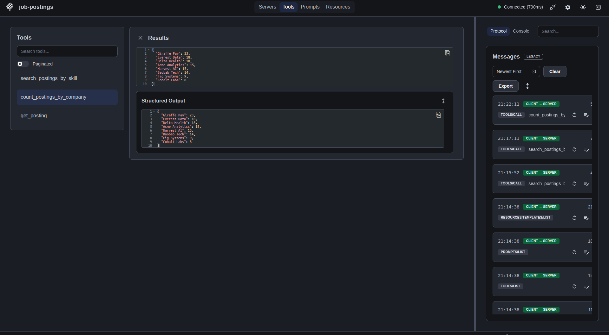
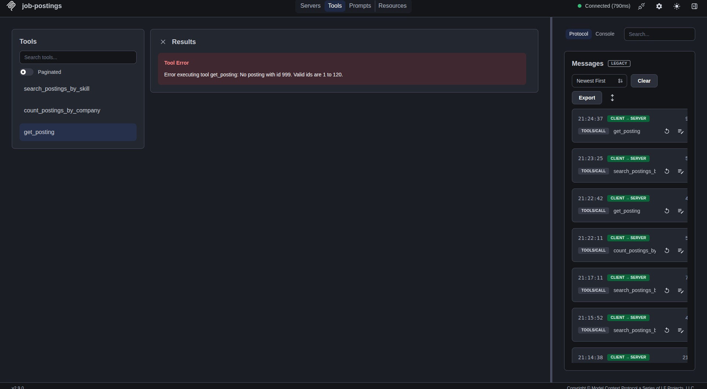

# Job Postings MCP Server

An MCP server in Python. It lets an AI assistant search and count job postings in a sample dataset. I built it for the MCP Engineer internship at Revelio Labs (through AkiraChix Studio).

I'm Eyerusalem, a software engineering student in the AkiraChix codeHive program in Nairobi. I usually build backends with Python and FastAPI. This is my first MCP server and my first Rust program.

## Tools

The data is 120 **fake** postings made by `scripts/generate_data.py`. It is not real job market data.

| Tool | Inputs | What it does |
|---|---|---|
| `search_postings_by_skill` | `skill`, `limit` (1 to 50, default 10) | Finds postings that list a skill |
| `count_postings_by_company` | `top_n` (1 to 100, default 10) | Counts postings per company, biggest first |
| `get_posting` | `posting_id` | Returns one full posting |

Search returns short summaries, not full postings. This keeps the answer small for the model. If it needs more, it calls `get_posting`.

## Proof it works

Screenshots from the MCP Inspector:






The last one shows a bad request. The model gets a clear message: `No posting with id 999. Valid ids are 1 to 120.`

## Run it

```bash
uv venv env
source env/bin/activate
uv pip install -r requirements.txt
mcp dev server.py
```

`mcp dev` opens the MCP Inspector (you need Node.js). Run the tests with `uv pip install -r requirements-dev.txt` and then `pytest`.

## Code layout

```
server.py        registers the tools with MCP
app/tools.py     the logic of each tool (no MCP code)
app/data.py      loads the data
tests/           tests for the tool logic
rust/            small Rust program that reads the same data
screenshots/     proof that it works
```

I kept the logic in `app/tools.py` so I can test it with plain `pytest`.

## Bad input

The SDK checks the types. My code checks the rest: an empty skill, a number out of range, or an id that does not exist. Each error says what to fix.

## How I would protect this server with OAuth 2.0

This is a plan. The server has no login yet.

- **Roles:** this server is the resource server. A separate authorization server logs users in and gives out tokens. The AI assistant is the client.
- **Flow:** authorization code flow with PKCE. The user logs in, the assistant gets a code and trades it for a token. PKCE keeps the code safe if someone steals it. The assistant never sees the user's password.
- **Where tokens are checked:** on every request, before any tool runs. I check the signature, the expiry, the issuer, the audience (the token must be made for this server) and the scopes. No token or a bad token gets a 401. A good token without the right scope gets a 403.
- **Scopes:** `postings:read` for search and get. `postings:stats` for the counts.
- **Who can see what:** scopes only say which tools a client can use. To limit the data, I would read the user id (`sub`) from the token and look up what that user is allowed to see. Then I filter every query on the server. The model cannot get around this by asking in a different way.
- **Other:** short-lived access tokens, refresh tokens kept by the client and easy to revoke, rate limits, a log of who called what, and no secrets in the repo.

The MCP security rules are still changing, so I would read the latest spec before building this.

## Rust

`rust/` has a small Rust program. It reads the same `data/postings.json` and can count postings by company or search by skill. Install Rust with [rustup](https://rustup.rs) (no admin rights needed). Run it from the project folder:

```bash
cargo run --manifest-path rust/Cargo.toml -- count
cargo run --manifest-path rust/Cargo.toml -- skill rust
```

The results match the Python server: Giraffe Pay has 23 postings, and 38 postings list `rust`.


## What I learned

- The tool name, description and type hints are what the model sees, so they must be clear.
- **A plain `ValueError` hides your message.** My first version used `ValueError` and my tests passed. But through a real MCP client, the model only saw `Error executing tool get_posting`. The SDK treats unexpected errors as crashes and hides the text. I fixed it by raising `ToolError`. My unit tests could not find this. Only calling the real server did.
- **Installing Rust without admin rights.** `apt install cargo` needs `sudo`, and I don't have it. rustup installs in the home folder, so I used that.

## Limits and next steps

- The data is fake and small.
- Search only matches exact skill names. A search for `node` returns nothing and gives no reason. I would add a tool that lists valid skills.
- No login yet. Next, I want to run the server over HTTP and check a token on every request.
- The Rust program only reads data. It is not an MCP server.

## Contact

Eyerusalem Gebremedhin, Nairobi
[github.com/EyerusalemGebremedhin](https://github.com/EyerusalemGebremedhin) · eyerusalemv@gmail.com

I also built Bloom, a maternal health app. Its FastAPI backend uses JWT login and role-based access, so mothers, health workers and admins only see their own data.